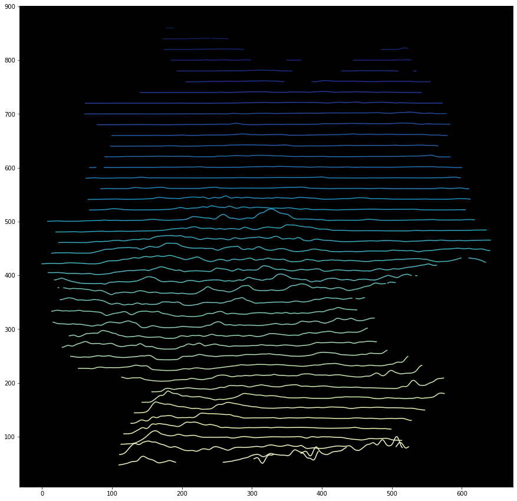

#Digitales Geländemodell / Digital Elevationmodel  

  

Dieses Repository enthält ein Skript in einem Jupyter-Notebook, welches auf Grundlage der DGM-Daten ein Linien-Modell erstellt.  

Mit Gauß-Filter:

Ohne Gauß-Filter:

